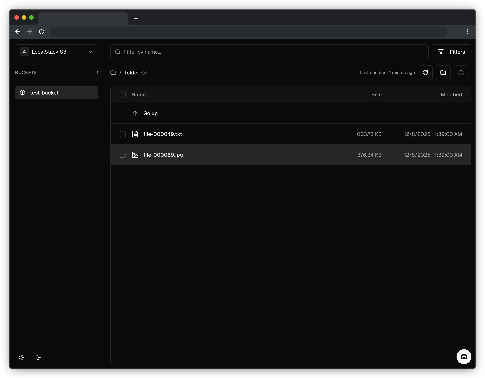

# bucketbrowser

A high-performance web-based object storage explorer for managing cloud storage across multiple platforms.



## Overview

bucketbrowser provides a fast, unified interface for exploring and managing object storage across major cloud providers. Built with Next.js and TypeScript, it offers efficient navigation through large buckets, full CRUD operations, and support for AWS S3, Azure Blob Storage, Google Cloud Storage, MinIO, and other S3-compatible storage providers.

## Features

- 🚀 High-performance UI with virtual scrolling
- 🔍 Advanced search and filtering
- 📊 Metadata management and bulk operations
- 🔐 Secure multi-connection management
- 📁 Hierarchical folder views
- ⚡ Concurrent operations for improved throughput
- 📈 Storage analytics and usage insights
- ⌨️ Keyboard shortcuts ([documentation](KEYBOARD_SHORTCUTS.md))
- 💾 Intelligent caching with prefetching

## Getting Started

### Installation

```bash
pnpm install
pnpm dev
```

Open [http://localhost:3000](http://localhost:3000) in your browser.

### Configuration

#### Read-Only Mode

Enable read-only mode to disable all write operations:

```bash
READ_ONLY=true pnpm dev
```

#### Local Testing

Use Docker Compose for local testing with storage emulators:

```bash
docker compose up -d
mkdir -p data
cp connections.yaml.example data/connections.yaml
pnpm dev
```

Optionally seed test data:

```bash
pnpm seed localstack-s3 test-bucket --count 100
```

See [DOCKER_SETUP.md](./DOCKER_SETUP.md) for complete setup instructions.

## Technology Stack

- **Next.js** - Full-stack React framework
- **TypeScript** - Type-safe development
- **Tailwind CSS** - Utility-first styling
- **AWS SDK, Azure Storage SDK, Google Cloud SDK** - Cloud provider integration

## Contributing

Contributions are welcome! Please submit issues and pull requests.

### Security Checks

This project uses [pre-commit](https://pre-commit.com) for security checks:

```bash
brew install pre-commit  # or: pip install pre-commit
pre-commit install
```

## License

_(License information to be added)_
